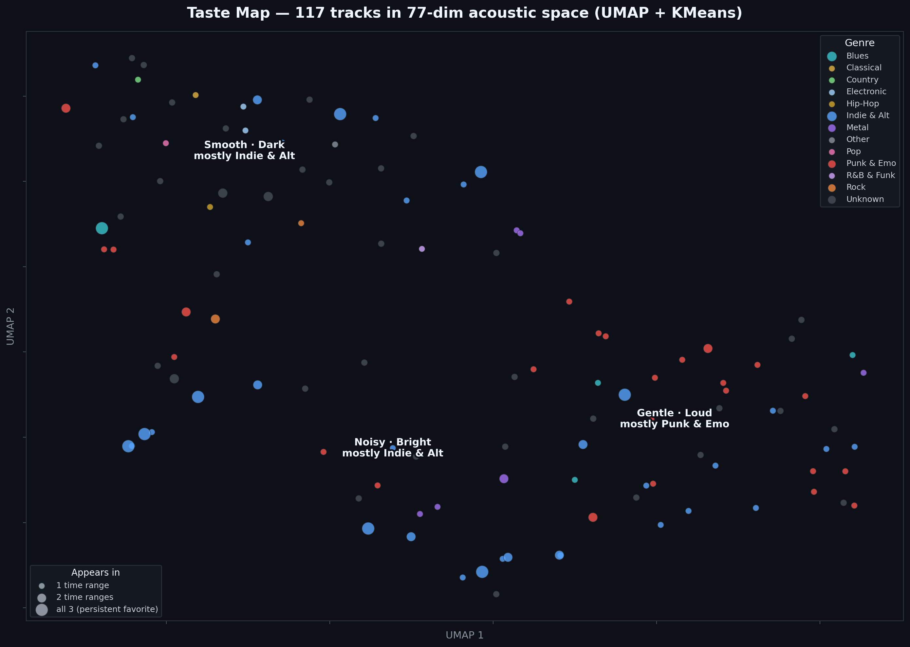

# 🎧 Vercillo Analytics — audio-agentic-pipeline

[](https://github.com/JordanVercillo/audio-agentic-pipeline/actions/workflows/ci.yml)

**A personal music-analytics data platform that rebuilds the acoustic intelligence Spotify's API deleted** — Spotify listening history → YouTube audio acquisition → local 77-dim DSP → medallion warehouse → taste analytics → a **live multi-user web app** and an **MCP server that lets AI agents query the warehouse directly.**

> When Spotify removed `/audio-features` for third-party apps in Feb 2026, every project that *consumed* those columns died. This one answers by becoming the **producer**: it acquires real audio, extracts its own feature space, and warehouses it for agents to query.

**🌐 Live at [vercilloanalytics.com](https://vercilloanalytics.com)** — self-hosted at $0, on-demand by design (a Cloudflare Worker serves an honest fallback when it's off). Browse the [song library](https://vercilloanalytics.com/library) and any track's acoustic deep-dive with no login; "View as guest" tours the full personalized dashboard; five PKCE pilot seats personalize it end-to-end (top tracks + playlist imports → local DSP → your own taste analytics). The build story: [`docs/CASE_STUDY.md`](docs/CASE_STUDY.md).



*The committed batch artifact: every track in a reproducible warehouse snapshot projected from its own 77-dimension acoustic fingerprint (UMAP + KMeans), colored by genre, sized by how many listening windows it persists in. Clusters are named by what **acoustically** distinguishes them — the vendor's genre tags were too sparse to do it. The live app serves a larger, continuously-grown corpus (**1946 analyzed tracks** today); the two planes are described below.*

---

> **New to the project?** [`docs/HOW_IT_WORKS.md`](docs/HOW_IT_WORKS.md)
> explains the whole system in plain language, with deeper pages for anything
> complicated. No data-engineering background needed.

## The 90-second tour

**The corpus is real and its provenance is verified.** The live app serves
**1946 analyzed tracks**, grown from real logins and playlist imports.
**1,894 have a recorded audio source** and shape every aggregate; the other 40
are *withheld* — from display **and** from the clusters, percentiles and chat —
until a source is verified. Every track that shapes a number can be traced,
one click, to the exact YouTube recording its features were measured from:

```text
$ uv run python scripts/qa_audit.py        # 9 checks over the LIVE corpus, exit 1 on any fail
 ✓ PASS [   A1] duration_sanity      no track's audio is implausibly longer than its Spotify length
 ✓ PASS [A2/A3] title_affinity       every machine-chosen acquisition still passes the affinity check
 · NOTE [  A2+] confident_match      1785/1895 recorded acquisitions (94.2%) would pass today's strict gate
 · NOTE [    Q] provenance_coverage  1894/1934 canonical analyzed (97.9%) have a source; 40 withheld
 ✓ PASS [   B2] aggregate_exclusion  all 203 excluded tracks are absent from every serving plane
 ✓ PASS [   A5] plane_coherence      feature store, perceptual plane and analyst card agree
 ✓ PASS [   B1] shared_gate          the live worker refuses a DJ set and a wrong-title candidate before downloading
 ✓ PASS [   A4] mp3_encoder          an MP3-capable ffmpeg resolves
 ✓ PASS [   A6] upload_cap           owner upload cap is 120 MB (lossless masters fit)
 0 failed · 7 passed · 2 notes
```

*(The 40 withheld are the ones excluded from the aggregates, so **every one of
the 1,894 tracks that shapes a number has a verified source** — 100% of the
serving corpus. The one absolute path in that output is elided; everything else
is verbatim.)*

**The result** (owner's snapshot, three listening windows — last 4 weeks / 6
months / all-time): taste archetype **"The Drifting Loyalist"** — one sound owns
most of the rotation, but the recent centroid has edged **0.185σ** from the
all-time average (RMS per-feature shift between standardized acoustic centroids;
a σ-shift, not a vibe). The full analysis is a single self-contained file:
[`artifacts/taste_report.html`](artifacts/taste_report.html).

**It's tested and audited — no secrets, no network needed for the test suite:**

```text
$ pytest
959 passed in 97.14s

$ uv run .claude/skills/warehouse-audit/audit_warehouse.py
errors: none · bridge-key + fact↔dim integrity green · exact feature-contract verified
26 quality flags, ALL FALSE — including the cluster-freshness and
CLUSTER_ASSIGNMENT_DESYNC tripwires added after a 2026-07-31 director review
found a promoted model disagreeing with its own stored assignments
```

**Two data planes, one bridge key.** The **live serving plane** (SQLite+WAL
cache + Parquet feature marts) is what the app renders and what the corpus
numbers above describe — continuously grown, provenance-tracked. The **batch
star-schema warehouse** (Bronze→Silver→Gold) is a *reproducible* artifact. Its
**catalog** (`dim_tracks` + a track-grain `fact_track_features`) is materialized
straight from the serving cache by one exporter, so the MCP server reads the
same canonical corpus the app serves, and a `GOLD_PLANE_STALE` audit check keeps
them in agreement. Its **temporal-drift fact** (`fact_listening_features`, the
per-listening-window grain behind the taste map) stays a point-in-time snapshot
by design — that grain is per-user listening rank, which can't be honestly
reproduced for the user-agnostic grown corpus without fabricating it. Same
bridge key, same 77-dim contract throughout.

```bash
uv sync                         # reproducible env from uv.lock
python scripts/run_pipeline.py  # 8 steps: fetch → acquire audio → DSP → medallion → insights
python scripts/build_report.py  # taste map + charts + single-file taste_report.html
```

**And an AI agent can query the warehouse** — the MCP server exposes the gold
star-schema (the reproducible batch snapshot) as three read-only tools
(`get_schema`, `query_warehouse`, `get_insights`):

```text
Q: What's my highest-energy track in each time range?
→ query_warehouse("SELECT time_range, track_name, primary_artist_name, round(rms_mean,3) energy
     FROM fact_listening_features f WHERE rms_mean =
     (SELECT max(rms_mean) FROM fact_listening_features g WHERE g.time_range=f.time_range) ...")
   short_term   Cut Back               — Marmozets     0.305
   long_term    Be With You            — Muse          0.291

Q: [adversarial] SELECT * FROM read_csv('/etc/passwd')
→ Query rejected: Forbidden keyword or function: 'read_csv'.  (and the DuckDB sandbox blocks it anyway)
```

Full registration + transcript: [`docs/AGENT_ACCESS.md`](docs/AGENT_ACCESS.md).

---

## Architecture — medallion warehouse, one bridge key

```
Spotify API (PKCE, no secret)        YouTube (yt-dlp + ffmpeg)
      │ top tracks/artists ×3 ranges       │ {spotify_track_id}.mp3
      ▼                                     ▼
   STAGING (Bronze) ── append-only snapshots + lineage
      ▼
   CLEANSED (Silver) ── typed, deduped; 77-dim DSP features (librosa)
      ▼
   MODELED (Gold) ── fact_listening_features + dim_{tracks,artists,time_range}
      │                + column_descriptions (agent-readable, exact-verified)
      ▼                    ▼                     ▼
  analysis/ (drift)   search/ (FAISS+UMAP)   agent/ (MCP server over the gold layer)
```

`spotify_track_id` is the **only** join key across metadata, audio filenames, features, and the star schema — the filename *is* the key (no lookup table). Parquet only, `pyarrow` engine.

## What makes it a platform-engineering piece

| Signal | Where |
|---|---|
| **Reproducible env** | `pyproject.toml` + `uv.lock` (pinned graph); `requirements.txt` kept as a pip export |
| **CI / quality gates** | GitHub Actions: `ruff` + `pytest` on every push & PR; 959 synthetic-data tests (no secrets, no network) |
| **Data quality** | deterministic `warehouse-audit` + `app-verify` — bridge-key integrity, fact↔dim joins, **exact** feature-contract verification, live-system flags |
| **Data provenance & lineage** | every acquisition writes an append-only `track_provenance` event (source URL, matcher, confidence, duration delta); a 9-check `qa_audit` sweep runs the whole regression set over **live** data and exits non-zero on any failure; unverified features are *withheld* from every aggregate, not just the display — a fail-safe stops an empty lineage table from emptying the corpus |
| **Production at $0** | self-hosted multi-user FastAPI app: session-scoped PKCE (no client secret exists), SQLite+WAL serving cache, DB-as-queue extraction worker, Cloudflare Tunnel + an origin-down fallback Worker |
| **Agents on data infra** | MCP server with a two-layer security model (SELECT-only guard + a capability-removed DuckDB sandbox) |
| **Scale-ready** | PySpark jobs for the distributed centroid/transform path (`spark/`) |
| **Honest metrics** | drift measured as an effect size (σ-shift), sanity-anchored; estimator honesty rules — see [`notes/engineering_journal.md`](notes/engineering_journal.md) |
| **AI-assisted engineering, documented** | a session harness (`.claude/`: living memory, skills, domain-expert agents) + a numbered lessons journal — the methodology is itself a portfolio piece: [`docs/CASE_STUDY.md`](docs/CASE_STUDY.md) |

## Repo map

```
src/ingestion/   Spotify PKCE auth + fetchers + one shared acquisition gate (title/artist/duration/reproduction) → idempotent YouTube→MP3
src/dsp/         librosa 77-dim feature extraction (the layer that replaces the vendor API)
src/warehouse/   medallion transforms: staging → cleansed → modeled (star schema)
src/store/       the serving layer: SQLite+WAL feature cache, DB-as-queue worker, clustering, dedup
src/webapp/      the live app: PKCE auth, dashboard/analytics/artists/library/playlists, RAG ask-box
src/analysis/    taste-drift engine + σ-normalized trend visuals + insight engine
src/search/      FAISS index + UMAP taste map
src/agent/       MCP server exposing the gold warehouse to AI agents (read-only)
src/export/      single-file HTML portfolio report
spark/           PySpark versions of the warehouse transforms
scripts/         run_pipeline.py, run_webapp.py, the worker, build_{taste_map,insights,report}.py
infra/           the $0 deployment edge (Cloudflare origin-fallback Worker)
.claude/         the session harness: skills, domain-expert agents, deterministic audits
artifacts/       committed portfolio outputs (taste map, charts, report)
legacy/          archived pre-pipeline v0 (not maintained)
```

## Run it yourself

```bash
uv sync                                   # reproducible env (Python 3.12+, ffmpeg on PATH)
echo "SPOTIPY_CLIENT_ID=<your public client id>" > .env       # PKCE — no secret exists
echo "SPOTIPY_REDIRECT_URI=http://127.0.0.1:8000/callback" >> .env
uv run python scripts/run_webapp.py       # the app on :8000 (guest mode works with no Spotify app at all
                                          #   once a demo snapshot exists; login needs your own dev-mode app)
uv run python scripts/run_extraction_worker.py --loop   # the DSP worker (downloads + analyzes queued tracks)
python scripts/run_pipeline.py            # or: the batch pipeline → warehouse → report
pytest                                    # 959 tests — synthetic audio, no credentials, no network
```

## Design docs

- **[`docs/CASE_STUDY.md`](docs/CASE_STUDY.md)** — the build story + the AI-assisted engineering methodology.
- **[`docs/VISION_SPECS.md`](docs/VISION_SPECS.md)** — the live roadmap: phases, acceptance criteria, numbered decision log (D-1…D-74).
- **[`notes/PROJECT_CONTEXT.md`](notes/PROJECT_CONTEXT.md)** — verified status + session log.
- **[`CLAUDE_INSTRUCTIONS.md`](CLAUDE_INSTRUCTIONS.md)** — architecture manual + ADRs.

---

*Built by Jordan Vercillo. Portfolio target: Data Engineer – Platform (pipelines at scale, developer experience, data quality, and systems that let AI agents work with data infrastructure). MIT licensed.*
